# DragonLedger DatabaseApp — Master Schema Reference

This document consolidates schema decisions from Phase 1.1's original design, Phase 2's import-driven additions, Phase 4's write-API-driven changes, and both Compendium design sessions into one current source of truth, with the full Prisma schema, an ER diagram, and worked examples showing exactly what a record looks like coming from each of the two import sources.

**Reconciled as of this update:** `ContentSubclass.classId`/`ContentSubrace.raceId` are now correctly shown as nullable with `onDelete: SetNull` (Phase 4's change, previously missing from this doc). `ContentFeat`, `ContentClassOption`, and `Language` (all from the Compendium sessions) are now included in Section 1's Prisma block. `ImportJobStatus` includes `AWAITING_CONFIRMATION`. Phase 4's "Correctable Fields" Zod-schema pattern is a validation-layer concept, not a schema-shape change, so it doesn't appear in the Prisma block itself — see `phase-4-write-api-final-export.md` for that mechanism.

**Compendium mapping status:** Feat, Spell, Item, Background, Class/Subclass, Monster, and — as of the most recent session — Race/Subrace have all been through a dedicated design pass for the Compendium specifically, cross-checked against real files where possible. See `compendium-import-final-export.md` and `compendium-race-subrace-reimport-safety-export.md` for the complete mappings, including two pipeline-wide mechanisms not reflected in the worked examples below: the Compendium's **additive-only, never-overwrite re-import behavior** (distinct from Open5e's delete-and-replace refresh) and the **cross-source parent-resolution rule** for Compendium-derived Subclasses/Subraces (prefers an Open5e-sourced parent match over a Compendium-sourced one). Both documents also carry a consolidated list of items flagged for verification against a broader sample before being trusted as final — several based on exactly one real file.

## 1. Full Prisma Schema

```prisma
enum SourceType {
  API
  FILE
  MANUAL
}

enum ImportJobType {
  OPEN5E
  FILE
}

enum ImportJobStatus {
  PENDING
  AWAITING_CONFIRMATION  // added — Compendium duplicate-check results pending user decision
  RUNNING
  COMPLETED
  FAILED
  PARTIAL
}

model Source {
  id          String     @id
  name        String
  type        SourceType
  description String?
  lastUpdated DateTime
  isDeletable Boolean

  spells      ContentSpell[]
  classes     ContentClass[]
  subclasses  ContentSubclass[]
  races       ContentRace[]
  subraces    ContentSubrace[]
  backgrounds ContentBackground[]
  conditions  ContentCondition[]
  items       ContentItem[]
  monsters    ContentMonster[]
  feats       ContentFeat[]
  classOptions ContentClassOption[]
  importJobs  ImportJob[]
}

model ImportJob {
  id             String          @id @default(cuid())
  sourceId       String
  source         Source          @relation(fields: [sourceId], references: [id])
  jobType        ImportJobType
  contentTypes   String          // JSON array, e.g. ["SPELL","ITEM"]
  status         ImportJobStatus @default(PENDING)
  totalItems     Int?
  processedItems Int             @default(0)
  errorLog       String?         // JSON array of { contentType, message }
  warnings       String?         // JSON array of { type, id, name, formerParentId } — Phase 4:
                                  // non-fatal FYI (e.g. a homebrew subclass orphaned by a refresh),
                                  // distinct from errorLog's real per-content-type failures
  startedAt      DateTime        @default(now())
  completedAt    DateTime?
}

model ContentSpell {
  id             String  @id @default(cuid())
  slug           String
  sourceId       String
  source         Source  @relation(fields: [sourceId], references: [id], onDelete: Cascade)
  name           String
  level          Int
  school         String
  castingTime    String
  range          String
  components     String
  material       String?
  duration       String
  concentration  Boolean
  ritual         Boolean
  classes        String  // JSON array of class display names
  description    String
  higherLevels   String?
  extraData      String? // castingOptions, damageRoll, damageTypes, savingThrow,
                          // attackRoll, targetType/targetCount, shape info, reactionCondition,
                          // materialCost, materialConsumed

  @@unique([sourceId, slug])
  @@index([level])
  @@index([school])
}

model ContentClass {
  id                  String  @id @default(cuid())
  slug                String
  sourceId            String
  source              Source  @relation(fields: [sourceId], references: [id], onDelete: Cascade)
  name                String
  hitDie              Int
  primaryAbility      String  // JSON: { abilities: string[], logic: "AND"|"OR" }
  savingThrows        String  // JSON array
  armorProfs          String  // JSON array
  weaponProfs         String  // JSON array
  skillChoices        String  // JSON, Fixed/Choice Grant Shape
  spellcastingAbility String?
  description         String
  extraData           String? // casterType, features[] (name/description/type/levels)

  subclasses          ContentSubclass[]

  @@unique([sourceId, slug])
}

model ContentSubclass {
  id          String        @id @default(cuid())
  slug        String
  sourceId    String
  source      Source        @relation(fields: [sourceId], references: [id], onDelete: Cascade)
  classId     String?       // nullable per Phase 4 — was required with onDelete: NoAction originally
  class       ContentClass? @relation(fields: [classId], references: [id], onDelete: SetNull)
  name        String
  description String
  extraData   String?      // features[]; unresolvedClassName if cross-source resolution (see Compendium docs) fails

  @@unique([sourceId, slug])
}

model ContentRace {
  id           String   @id @default(cuid())
  slug         String
  sourceId     String
  source       Source   @relation(fields: [sourceId], references: [id], onDelete: Cascade)
  name         String
  size         String   // JSON array, e.g. ["medium"] or ["small","medium"]
  speed        String   // JSON, { walk, fly?, swim? }
  traits       String   // JSON array of { name, description, level, grant? }
  description  String
  extraData    String?

  parentRaceId String?
  parentRace   ContentRace?     @relation("RaceSubspecies", fields: [parentRaceId], references: [id], onDelete: NoAction)
  subspecies   ContentRace[]    @relation("RaceSubspecies")
  subraces     ContentSubrace[]

  @@unique([sourceId, slug])
}

model ContentSubrace {
  id          String       @id @default(cuid())
  slug        String
  sourceId    String
  source      Source       @relation(fields: [sourceId], references: [id], onDelete: Cascade)
  raceId      String?      // nullable per Phase 4 — was required with onDelete: NoAction originally
  race        ContentRace? @relation(fields: [raceId], references: [id], onDelete: SetNull)
  name        String
  description String?
  size        String?      // JSON array, null unless this subrace overrides the parent's
  speed       String?      // JSON, null unless overridden
  traits      String       // JSON array, same shape as ContentRace.traits
  extraData   String?      // unresolvedRaceName if cross-source resolution (see Compendium docs) fails

  @@unique([sourceId, slug])
}

model ContentBackground {
  id             String  @id @default(cuid())
  slug           String
  sourceId       String
  source         Source  @relation(fields: [sourceId], references: [id], onDelete: Cascade)
  name           String
  proficiencies  String  // JSON, Fixed/Choice Grant Shape, entries tagged category: "skill"|"tool"
  abilityBonuses String  // JSON, Fixed/Choice Grant Shape (fixed is an object, not array)
  feature        String  // JSON array of { name, description }
  description    String
  extraData      String? // languages, equipment, unrecognizedBenefits[], flavor text

  @@unique([sourceId, slug])
}

model ContentCondition {
  id          String  @id @default(cuid())
  slug        String
  sourceId    String
  source      Source  @relation(fields: [sourceId], references: [id], onDelete: Cascade)
  name        String
  description String
  effects     String?
  extraData   String? // descriptionSource/requestedSource (when a fallback was used), icon

  @@unique([sourceId, slug])
}

model ContentItem {
  id                 String  @id @default(cuid())
  slug               String
  sourceId           String
  source             Source  @relation(fields: [sourceId], references: [id], onDelete: Cascade)
  name               String
  itemType           String
  rarity             String?
  requiresAttunement Boolean
  cost               String?
  weight             String?
  damage             String?
  armorClass         String?
  properties         String? // JSON array of { name, detail? }
  description        String
  extraData          String? // size, range, isSimple/isMartial/isImprovised,
                              // stealthDisadvantage, maxDexBonus, addDexMod, strRequired,
                              // acDisplay, attunementDetail

  @@unique([sourceId, slug])
  @@index([itemType])
  @@index([rarity])
}

model ContentMonster {
  id                     String  @id @default(cuid())
  slug                   String
  sourceId               String
  source                 Source  @relation(fields: [sourceId], references: [id], onDelete: Cascade)
  name                   String
  size                   String
  monsterType            String
  alignment              String
  armorClass             Int
  hitPoints              Int
  hitDice                String
  speed                  String  // JSON
  abilityScores          String  // JSON
  savingThrows           String?
  skills                 String?
  damageResistances      String?
  damageImmunities       String?
  damageVulnerabilities  String?
  conditionImmunities    String?
  senses                 String?
  languages              String?
  challengeRating        String
  actions                String  // JSON array, each tagged actionType: "action"|"bonus"|"reaction"
  legendaryActions       String?
  description            String?
  extraData              String? // armorClassDetail, lairActions, traits[], spellcasting,
                                  // proficiencyBonus, legendaryResistances, experiencePoints,
                                  // category/subcategory

  @@unique([sourceId, slug])
  @@index([challengeRating])
  @@index([monsterType])
}

model ContentFeat {
  id           String  @id @default(cuid())
  slug         String
  sourceId     String
  source       Source  @relation(fields: [sourceId], references: [id], onDelete: Cascade)
  name         String
  category     String  // "GENERAL" | "ORIGIN" | "FIGHTING_STYLE" | "EPIC_BOON" | "CLASS_SPECIFIC"
  prerequisite String?
  description  String
  extraData    String? // benefits[] (Open5e only), special, modifiers[]

  @@unique([sourceId, slug])
}

model ContentClassOption {
  id           String        @id @default(cuid())
  slug         String
  sourceId     String
  source       Source        @relation(fields: [sourceId], references: [id], onDelete: Cascade)
  classId      String?
  class        ContentClass? @relation(fields: [classId], references: [id], onDelete: SetNull)
  pool         String        // "Metamagic" | "Eldritch Invocation" | "Maneuver" | future pools
  name         String
  description  String
  prerequisite String?
  extraData    String?

  @@unique([sourceId, slug])
}

model Language {
  id       String @id @default(cuid())
  name     String @unique
  category String // "common" | "exotic" | "secret"
}
```

`ContentClass` also gains a back-relation for the new `ContentClassOption` table: `classOptions ContentClassOption[]`, alongside its existing `subclasses` relation.

## 2. Entity Relationship Diagram

```mermaid
erDiagram
    SOURCE ||--o{ CONTENT_SPELL : contains
    SOURCE ||--o{ CONTENT_CLASS : contains
    SOURCE ||--o{ CONTENT_SUBCLASS : contains
    SOURCE ||--o{ CONTENT_RACE : contains
    SOURCE ||--o{ CONTENT_SUBRACE : contains
    SOURCE ||--o{ CONTENT_BACKGROUND : contains
    SOURCE ||--o{ CONTENT_CONDITION : contains
    SOURCE ||--o{ CONTENT_ITEM : contains
    SOURCE ||--o{ CONTENT_MONSTER : contains
    SOURCE ||--o{ CONTENT_FEAT : contains
    SOURCE ||--o{ CONTENT_CLASS_OPTION : contains
    SOURCE ||--o{ IMPORT_JOB : tracks

    CONTENT_CLASS ||--o{ CONTENT_SUBCLASS : "has subclasses (SetNull, cross-source resolvable)"
    CONTENT_RACE ||--o{ CONTENT_SUBRACE : "has subraces (SetNull, cross-source resolvable)"
    CONTENT_RACE ||--o{ CONTENT_RACE : "parentRace self-relation (NoAction, 2014-style subspecies)"
    CONTENT_CLASS ||--o{ CONTENT_CLASS_OPTION : "has options (SetNull) — Metamagic/Invocations/Maneuvers"

    CONTENT_FEAT {
        string id PK "cuid"
        string slug "unique within sourceId"
        string sourceId FK
        string name
        string category "GENERAL|ORIGIN|FIGHTING_STYLE|EPIC_BOON|CLASS_SPECIFIC"
        string prerequisite
        string description
        string extraData "JSON escape hatch"
    }

    CONTENT_CLASS_OPTION {
        string id PK "cuid"
        string slug "unique within sourceId"
        string sourceId FK
        string classId FK "nullable, SetNull"
        string pool "Metamagic|Eldritch Invocation|Maneuver"
        string name
        string description
        string prerequisite
        string extraData "JSON escape hatch"
    }

    LANGUAGE {
        string id PK "cuid"
        string name UK "unique"
        string category "common|exotic|secret"
    }

    SOURCE {
        string id PK "human-assigned, e.g. open5e-srd-2024"
        string name
        enum type "API | FILE | MANUAL"
        string description
        datetime lastUpdated
        bool isDeletable
    }

    IMPORT_JOB {
        string id PK "cuid"
        string sourceId FK
        enum jobType "OPEN5E | FILE"
        string contentTypes "JSON array"
        enum status "PENDING|AWAITING_CONFIRMATION|RUNNING|COMPLETED|FAILED|PARTIAL"
        int totalItems
        int processedItems
        string errorLog "JSON array"
        datetime startedAt
        datetime completedAt
    }

    CONTENT_SPELL {
        string id PK "cuid"
        string slug "unique within sourceId"
        string sourceId FK
        string name
        int level "indexed"
        string school "indexed"
        string castingTime
        string range
        string components
        string material
        string duration
        bool concentration
        bool ritual
        string classes "JSON array of names"
        string description
        string higherLevels
        string extraData "JSON escape hatch"
    }

    CONTENT_CLASS {
        string id PK "cuid"
        string slug "unique within sourceId"
        string sourceId FK
        string name
        int hitDie
        string primaryAbility "JSON: abilities[] + AND/OR logic"
        string savingThrows "JSON array"
        string armorProfs "JSON array"
        string weaponProfs "JSON array"
        string skillChoices "JSON, Fixed/Choice shape"
        string spellcastingAbility
        string description
        string extraData "JSON escape hatch"
    }

    CONTENT_SUBCLASS {
        string id PK "cuid"
        string slug "unique within sourceId"
        string sourceId FK
        string classId FK "nullable, SetNull, cross-source resolvable"
        string name
        string description
        string extraData "JSON escape hatch"
    }

    CONTENT_RACE {
        string id PK "cuid"
        string slug "unique within sourceId"
        string sourceId FK
        string parentRaceId FK "nullable, self-relation, NoAction"
        string name
        string size "JSON array"
        string speed "JSON object"
        string traits "JSON array, entries may include grant"
        string description
        string extraData "JSON escape hatch"
    }

    CONTENT_SUBRACE {
        string id PK "cuid"
        string slug "unique within sourceId"
        string sourceId FK
        string raceId FK "nullable, SetNull, cross-source resolvable"
        string name
        string description
        string size "JSON array, nullable"
        string speed "JSON object, nullable"
        string traits "JSON array"
        string extraData "JSON escape hatch"
    }

    CONTENT_BACKGROUND {
        string id PK "cuid"
        string slug "unique within sourceId"
        string sourceId FK
        string name
        string proficiencies "JSON, Fixed/Choice shape, category-tagged"
        string abilityBonuses "JSON, Fixed/Choice shape"
        string feature "JSON array"
        string description
        string extraData "JSON escape hatch"
    }

    CONTENT_CONDITION {
        string id PK "cuid"
        string slug "unique within sourceId"
        string sourceId FK
        string name
        string description
        string effects
        string extraData "JSON escape hatch"
    }

    CONTENT_ITEM {
        string id PK "cuid"
        string slug "unique within sourceId"
        string sourceId FK
        string name
        string itemType "indexed"
        string rarity "indexed"
        bool requiresAttunement
        string cost
        string weight
        string damage
        string armorClass
        string properties "JSON array of name/detail objects"
        string description
        string extraData "JSON escape hatch"
    }

    CONTENT_MONSTER {
        string id PK "cuid"
        string slug "unique within sourceId"
        string sourceId FK
        string name
        string size
        string monsterType "indexed"
        string alignment
        int armorClass
        int hitPoints
        string hitDice
        string speed "JSON object"
        string abilityScores "JSON object"
        string savingThrows "JSON object"
        string skills "JSON object"
        string damageResistances "JSON array"
        string damageImmunities "JSON array"
        string damageVulnerabilities "JSON array"
        string conditionImmunities "JSON array"
        string senses
        string languages
        string challengeRating "indexed"
        string actions "JSON array, tagged by actionType"
        string legendaryActions "JSON array"
        string description
        string extraData "JSON escape hatch"
    }
```



## 3. Worked Examples

Three content types are worked through end-to-end below: Spells (simplest), Races/Subraces (most structurally involved), and Monsters (richest). Each shows the raw input from both sources side by side, then the resulting database row.

### 3.1 Spells

**Open5e input** (`GET /v2/spells/`, abbreviated):

```json
{
  "key": "srd-2024_fireball",
  "name": "Fireball",
  "level": 3,
  "school": { "key": "evocation" },
  "casting_time": "action",
  "range_text": "150 feet",
  "duration": "instantaneous",
  "concentration": false,
  "ritual": false,
  "desc": "A bright streak flashes from your finger...",
  "higher_level": "When you cast this spell using a spell slot of 4th level or higher...",
  "verbal": true, "somatic": true, "material": true,
  "material_specified": "a tiny ball of bat guano and sulfur",
  "classes": [{ "name": "Sorcerer" }, { "name": "Wizard" }],
  "document": { "key": "srd-2024" },
  "damage_roll": "8d6",
  "damage_types": ["fire"],
  "target_type": "point",
  "shape_type": "sphere",
  "shape_size": 20,
  "casting_options": [{ "type": "default", "range": null, "duration": null }]
}
```

**Compendium input** (`Complete_Compendium_5.5e.xml` `<spell>`, illustrative — constructed from the documented shape, not extracted from the live file):

```xml
<spell>
  <name>Fireball [5.5e]</name>
  <level>3</level>
  <school>EV</school>
  <classes>Sorcerer, Wizard</classes>
  <time>Action</time>
  <range>150 feet</range>
  <components>V, S, M (a tiny ball of bat guano and sulfur)</components>
  <duration>Instantaneous</duration>
  <ritual/>
  <text>A bright streak flashes from your finger to a point you choose within range...

When you cast this spell using a spell slot of 4th level or higher...

Source:	Player's Handbook (2024) p. 255</text>
</spell>
```

**Resulting `ContentSpell` row** (shown as the JS object Prisma would receive — identical regardless of which source it came from, since both feed the same schema):

```json
{
  "slug": "fireball",
  "sourceId": "srd-2024",
  "name": "Fireball",
  "level": 3,
  "school": "evocation",
  "castingTime": "action",
  "range": "150 feet",
  "components": "V, S, M",
  "material": "a tiny ball of bat guano and sulfur",
  "duration": "instantaneous",
  "concentration": false,
  "ritual": false,
  "classes": "[\"Sorcerer\",\"Wizard\"]",
  "description": "A bright streak flashes from your finger to a point you choose within range...",
  "higherLevels": "When you cast this spell using a spell slot of 4th level or higher...",
  "extraData": "{\"damageRoll\":\"8d6\",\"damageTypes\":[\"fire\"],\"targetType\":\"point\",\"aoeShape\":\"sphere\",\"aoeSize\":20}"
}
```

Compendium-specific notes — **now settled** (full mapping in `compendium-import-final-export.md`, Section 4.2):

- `school` code (`"EV"`) → name lookup: A/C/D/EN/EV/I/N/T, confirmed against the documented legend.
- `[5.5e]`/`(HB)` suffixes are stripped from `name`, tagged in `extraData.edition`/`extraData.homebrew`.
- Source citation drives `sourceId` resolution via the per-book `Source`-row strategy (Section 1.1 of the Compendium export) — **not** one flat Source for the whole file, as originally guessed here; citations are parsed per-record into real per-book sources, with a single fallback source for anything uncredited.
- `<components>`'s non-standard content (e.g. `"(1 sorcery point)"` for Maneuvers) is a non-issue in practice — this app's `components` field was always a plain display string, not parsed V/S/M flags, so whatever text is there is simply stored as-is.
- **Real finding, not originally anticipated:** Maneuvers aren't just "spells with odd components" — they hijack the `<spell>` schema entirely and aren't spells at all. Detected via `<classes>` reading `"Maneuver Options"` and **rerouted to a new `ContentClassOption` table** (`pool: "Maneuver"`), not imported as `ContentSpell`. The same table also holds Metamagic and Eldritch Invocations from both sources — a themed, class-gated option pool is a distinct concept from both a Feature (automatic) and a Feat (class-agnostic).

### 3.2 Races & Subraces

**Open5e input** (`GET /v2/species/`, the Elf record — abbreviated, showing the lineage trait that becomes synthetic subraces):

```json
{
  "key": "srd-2024_elf",
  "is_subspecies": false,
  "name": "Elf",
  "desc": "",
  "document": { "key": "srd-2024" },
  "traits": [
    { "name": "Size", "desc": "Medium (about 5–6 feet tall)", "type": "SIZE", "order": 1 },
    { "name": "Speed", "desc": "30 feet", "type": "SPEED", "order": 2 },
    { "name": "Darkvision", "desc": "You have Darkvision with a range of 60 feet.", "type": null, "order": 3 },
    { "name": "Elven Lineage", "desc": "Choose a lineage from the Elven Lineages table...\n\n|Lineage|Level 1|Level 3|Level 5|\n|---|---|---|---|\n|Drow|The range of your Darkvision increases to 120 feet...|Faerie Fire|Darkness|\n|High Elf|You know the Prestidigitation cantrip...|Detect Magic|Misty Step|\n|Wood Elf|Your Speed increases to 35 feet...|Longstrider|Pass without Trace|", "type": null, "order": 4 },
    { "name": "Fey Ancestry", "desc": "You have Advantage on saving throws...", "type": null, "order": 5 }
  ]
}
```

**Compendium input** (`<race>`, illustrative — a real separate-record subrace, matching the 2014-style pattern this schema was originally built for):

```xml
<race>
  <name>Wood Elf [HB]</name>
  <size>M</size>
  <speed>35</speed>
  <ability>Wis +1</ability>
  <ancestry>Elf</ancestry>
  <trait category="description">
    <name>Description</name>
    <text>Wood elves have a supernatural connection to nature...</text>
  </trait>
  <trait>
    <name>Fleet of Foot</name>
    <text>Your base walking speed increases to 35 feet.</text>
  </trait>
  <trait>
    <name>Mask of the Wild</name>
    <text>You can attempt to hide even when you are only lightly obscured by foliage, heavy rain, falling snow, mist, and other natural phenomena.</text>
  </trait>
</race>
```

**Resulting rows:**

`ContentRace` (Elf, base):

```json
{
  "slug": "elf",
  "sourceId": "srd-2024",
  "name": "Elf",
  "size": "[\"medium\"]",
  "speed": "{\"walk\":30}",
  "traits": "[{\"name\":\"Darkvision\",\"description\":\"You have Darkvision with a range of 60 feet.\",\"level\":1},{\"name\":\"Fey Ancestry\",\"description\":\"You have Advantage on saving throws...\",\"level\":1}]",
  "description": null,
  "extraData": null
}
```

`ContentSubrace` (Wood Elf, **synthesized** from Elf's "Elven Lineage" trait — this is the parsing step flagged in the Phase 2 export, not a direct field-for-field copy):

```json
{
  "slug": "elf-wood-elf",
  "sourceId": "srd-2024",
  "raceId": "<Elf's generated cuid>",
  "name": "Wood Elf",
  "size": null,
  "speed": "{\"walk\":35}",
  "traits": "[{\"name\":\"Level 1 Benefit\",\"description\":\"Your Speed increases to 35 feet. You also know the Druidcraft cantrip.\",\"level\":1},{\"name\":\"Level 3 Benefit\",\"description\":\"Longstrider\",\"level\":3},{\"name\":\"Level 5 Benefit\",\"description\":\"Pass without Trace\",\"level\":5}]",
  "extraData": null
}
```

`ContentSubrace` (Wood Elf, **from the Compendium** — a real separate record this time, no synthesis needed, following the schema's original 2014-style design):

```json
{
  "slug": "wood-elf-hb",
  "sourceId": "fc5-compendium",
  "raceId": "<resolved by matching ancestry \"Elf\" to an already-imported Elf row — illustrative; exact resolution strategy not yet decided>",
  "name": "Wood Elf",
  "size": "[\"medium\"]",
  "speed": "{\"walk\":35}",
  "traits": "[{\"name\":\"Fleet of Foot\",\"description\":\"Your base walking speed increases to 35 feet.\",\"level\":1},{\"name\":\"Mask of the Wild\",\"description\":\"You can attempt to hide even when you are only lightly obscured...\",\"level\":1}]",
  "extraData": "{\"homebrew\":true}"
}
```

**✅ STATUS: Race/Subrace has now been through a dedicated Compendium session**, verified against two real files (`Elf, Wood Elf 2024.xml`, `Dwarf 2024.xml`). Full mapping lives in `compendium-race-subrace-reimport-safety-export.md` — the summary below corrects several things this section previously guessed wrong.

**Two of the illustrative example's core assumptions above turned out to be incorrect, confirmed against real data:**

1. **No lineage-table synthesis needed for Compendium subraces at all.** The "synthesized from Elf's Elven Lineage trait" `ContentSubrace` example above describes the Open5e-side problem (a lineage choice embedded in the base race) — the Compendium doesn't work that way. A real Wood Elf file is a **complete, standalone race record** with its own full trait list (Darkvision, Fey Ancestry, Keen Senses, Trance, all duplicated from Elf), imported directly as one `ContentSubrace` row — no synthesis parser required.
2. **`<ancestry>` doesn't appear in either real file**, despite being documented. The actual subrace signal is in the **name**: a comma-separated `"ParentRace, SubraceName Edition"` convention (`"Elf, Wood Elf 2024"` vs. base `"Dwarf 2024"`). The `sourceId: "fc5-compendium"` value shown above is also stale — real `sourceId` values are per-book, parsed from citation text (Section 1.1 of the main Compendium export).

**One real, deliberately-designed difference from the base-Elf example above:** a real subrace's Description text opens with the parent race's general lore duplicated verbatim before its own specific content. The settled design strips this via safeguarded paragraph-matching against the already-imported parent (never strips on a low-confidence match — see the Race/Subrace export's Section 2 for the full mechanism), rather than storing the duplication as-is.

Also confirmed real and worth noting: `<size>`/`<speed>` are genuine dedicated fields on Compendium races (no trait name-matching needed, unlike the Open5e approach this doc's `ContentRace` example above illustrates), and per-trait edition suffixes (`"Darkvision 2024"`) follow the same per-element tagging pattern found in Class/Subclass's real Cleric file, not just a once-per-record suffix.

**Still open, not resolved even after the real-file session:** whether `<ability>`/`<resist>`/`<proficiency>`/`<languages>` (fields with no dedicated `ContentRace` column) should synthesize into `traits[]` entries or live in `extraData` — flagged in the Race/Subrace export as an unresolved decision, and one of the fields elevated to a higher-priority validation requirement given how much the real files already overturned assumptions here.

### 3.3 Monsters

**Open5e input** (`GET /v2/creatures/`, abbreviated — a simple, non-shapeshifting example):

```json
{
  "key": "srd-2024_goblin",
  "name": "Goblin",
  "size": { "key": "small" },
  "type": { "key": "fey" },
  "alignment": "neutral evil",
  "armor_class": 15,
  "hit_points": 7,
  "hit_dice": "2d6",
  "challenge_rating": 0.25,
  "speed_all": { "unit": "feet", "walk": 30 },
  "ability_scores": { "strength": 8, "dexterity": 15, "constitution": 10, "intelligence": 10, "wisdom": 8, "charisma": 8 },
  "skill_bonuses": { "stealth": 6 },
  "darkvision_range": 60,
  "passive_perception": 9,
  "languages": { "as_string": "Common, Goblin" },
  "document": { "key": "srd-2024" },
  "actions": [
    {
      "name": "Scimitar",
      "desc": "Melee Weapon Attack...",
      "action_type": "ACTION",
      "attacks": [{ "to_hit_mod": 4, "damage_die_count": 1, "damage_die_type": "D6", "damage_bonus": 2, "extra_damage_type": { "key": "slashing" } }]
    }
  ],
  "traits": [
    { "name": "Nimble Escape", "desc": "The goblin can take the Disengage or Hide action as a Bonus Action on each of its turns." }
  ]
}
```

**Compendium input** (`<monster>`, illustrative — same creature):

```xml
<monster>
  <name>Goblin [5.5e]</name>
  <size>S</size>
  <type>fey</type>
  <alignment>Neutral Evil</alignment>
  <ac>15</ac>
  <hp>7</hp>
  <speed>walk 30 ft.</speed>
  <str>8</str><dex>15</dex><con>10</con><int>10</int><wis>8</wis><cha>8</cha>
  <skill>Stealth +6</skill>
  <senses>darkvision 60 ft.</senses>
  <passive>9</passive>
  <languages>Common, Goblin</languages>
  <cr>1/4</cr>
  <trait>
    <name>Nimble Escape</name>
    <text>The goblin can take the Disengage or Hide action as a Bonus Action on each of its turns.</text>
  </trait>
  <action>
    <name>Scimitar</name>
    <text>Melee Weapon Attack: +4 to hit, reach 5 ft., one target. Hit: 5 (1d6 + 2) slashing damage.</text>
    <attack>Slashing Damage||1d6+2</attack>
  </action>
</monster>
```

**Resulting `ContentMonster` row:**

```json
{
  "slug": "goblin",
  "sourceId": "srd-2024",
  "name": "Goblin",
  "size": "small",
  "monsterType": "fey",
  "alignment": "neutral evil",
  "armorClass": 15,
  "hitPoints": 7,
  "hitDice": "2d6",
  "challengeRating": "1/4",
  "speed": "{\"unit\":\"feet\",\"walk\":30}",
  "abilityScores": "{\"strength\":8,\"dexterity\":15,\"constitution\":10,\"intelligence\":10,\"wisdom\":8,\"charisma\":8}",
  "skills": "{\"stealth\":6}",
  "senses": "darkvision 60 ft., passive Perception 9",
  "languages": "Common, Goblin",
  "actions": "[{\"name\":\"Scimitar\",\"description\":\"Melee Weapon Attack...\",\"actionType\":\"action\",\"toHitMod\":4,\"damage\":\"1d6+2 slashing\"}]",
  "extraData": "{\"traits\":[{\"name\":\"Nimble Escape\",\"description\":\"The goblin can take the Disengage or Hide action as a Bonus Action on each of its turns.\"}]}"
}
```

Compendium-specific notes — **updated with settled decisions**:

- `sourceId` in this example is stale — `"srd-2024"` implies the flat single-file assumption this doc originally made. The actual settled design (Compendium export, Section 1.1) resolves a real per-book source from the citation embedded in `<description>`/`<text>` (not shown on this abbreviated Goblin example) — this Goblin's real `sourceId` would be something like a parsed `"Monster Manual (2024)"` source, not a generic Compendium-wide id.
- The `<attack>` field's single pipe-delimited string (`"Slashing Damage||1d6+2"`) parses via a simple split on `||` to compose `damage` — confirmed straightforward, no change from the original note.
- **To-hit bonus — decision made, correcting the original note's suggestion:** rather than regexing `"+4 to hit"` out of free `<text>`, the settled decision (per Compendium export Section 4.5's sibling discussion) is to **leave the to-hit bonus unset** for Compendium-sourced actions, keeping the full `<text>` intact for a human to read — avoiding the risk of an inconsistent regex match across thousands of monster records.
- **This Goblin example doesn't showcase the two real parsing wins from the dedicated session**, since Goblin has no resistances and no telepathy. See `compendium-import-final-export.md` Section 3.1–3.2 for the actual composite resistance/immunity parser (recognizes the "B/P/S from nonmagical attacks, unless silvered" template as one structured entry rather than naively splitting or losing the qualifier) and the telepathy-range extraction fix (pulled separately from language text, since neither source's "clean" structured language field captures it) — both apply identically regardless of source.

## 4. What's Genuinely Settled vs. Still Open

**Settled, full mapping + edge-case review completed:**
- All seven Open5e content-type mappings from Phase 2 (Spells, Conditions, Races/Subraces, Background, Classes/Subclasses, Items, Monsters), plus the Fixed/Choice Grant Shape convention.
- Phase 4's write-API-driven schema changes: `ContentSubclass.classId`/`ContentSubrace.raceId` nullable with `onDelete: SetNull` (now reflected in Section 1's Prisma block), the Correctable Fields validation pattern (a Zod-layer concept, not a schema shape — see `phase-4-write-api-final-export.md`).
- From the Compendium sessions, for the Compendium specifically: Feat (new content type, both sources), Spell, Item, Background (flagged — 6-record sample), Class/Subclass (flagged — 1-file sample), Monster, and Race/Subrace (flagged — 2-file sample, and elevated to a higher-priority validation requirement alongside Class/Subclass — see below).
- Cross-cutting additions, now all reflected in Section 1: `ContentFeat`, `ContentClassOption`, `Language` tables; the composite resistance/immunity/telepathy parser; per-book source-citation parsing (fully superseding this doc's original one-flat-source assumption); the batch-level cross-source duplicate-detection flow (`ImportJob.AWAITING_CONFIRMATION`); the Compendium's additive-only, never-overwrite re-import behavior (distinct from Open5e's delete-and-replace refresh); and the cross-source parent-resolution rule for Compendium-derived Subclasses/Subraces (prefers an Open5e-sourced match).

**Explicitly flagged as needing a broader sample before trusting as final** (see `compendium-import-final-export.md` Section 5 and `compendium-race-subrace-reimport-safety-export.md` Section 5 for the complete lists): Background's bullet-parsing heuristic, Feat's category-default assumption, Item's rarity/attunement text-parsing, the multi-book-citation case, and — called out as an **elevated, higher-priority validation requirement, not just a standard flag** — Class/Subclass's parenthetical-suffix detection rule and Race/Subrace's comma-separated naming convention, both verified against exactly one or two real files so far.

**One decision still genuinely open, not just unverified:** whether Race's `<ability>`/`<resist>`/`<proficiency>`/`<languages>` fields (no dedicated `ContentRace` column exists for any of them) should synthesize into `traits[]` entries or live in `extraData` — this wasn't resolved even after real files were inspected, unlike everything else in this document.

**Fully reconciled as of this pass:** the earlier "known gap" (Phase 4's schema changes missing from Section 1) and the earlier "not yet covered at all" (Race/Subrace) have both been closed out. This document should now be treated as current across Phase 1.1, Phase 2, Phase 4, and both Compendium sessions — Phase 5 (Browse UI) is a client-side design with no schema impact, so it was never a gap here.
